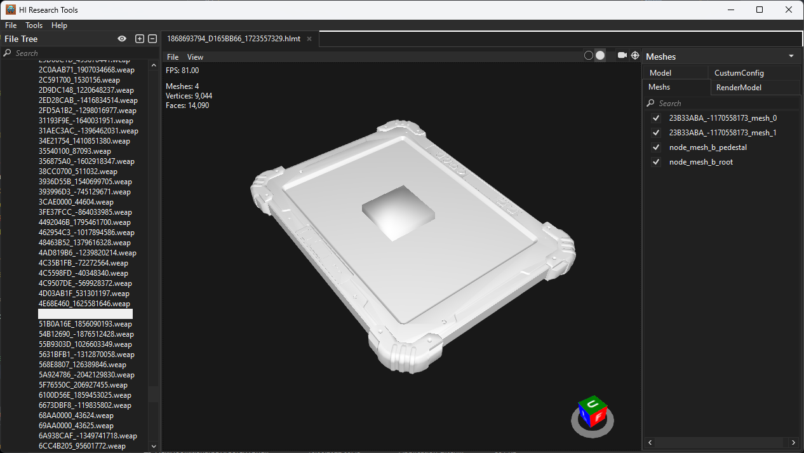

<a href="https://discord.com/invite/haloarchive">
  <h1 align="center">
    <picture>
      
    </picture>
  </h1>
</a>

# [Download](https://github.com/urium1186/HIRT/releases/latest)

**HIRT** is a research tool written in C# that features a variety of utilities for extracting assets and tags from Halo Infinite. It features both a CLI and GUI which can:

- Export models/textures
- Extract tags to JSON format
- Read modules from memory
- Dump tag structures
- Inspect shader bytecode and much more.

## Compilation
HIRT can be compiled using the [C# VS Code Extension](https://marketplace.visualstudio.com/items?itemName=ms-dotnettools.csharp) or Visual Studio with .NET features enabled. Running the "Release" launch  configuration will build the binaries required to access the GUI and CLI, which share the same executable.

## Dependencies
- [.NET 6.0 Framework](https://dotnet.microsoft.com/en-us/download)
- [Halo Infinite](https://store.steampowered.com/app/1240440)

## Setup

### Dumping Tag Structures

To start working with Halo Infinite files, you first have to dump the tag structures. **Firstly,** you need to launch Halo Infinite and wait until the main menu loads.

When it is loaded, you can open HIRT and navigate to **Tools > Tag Structs Dumper.** Set the output directory to any directory you prefer, and while making sure the game is running, press **"Dump"**. You should now restart the GUI to ensure the tag structures have loaded

### Configuration

HIRT features a variety of configuration options available in **Tools > Preferences.** These include:


#### Files
- `Default Halo Infinite Directory:` Point this to the **"deploy"** directory of your Halo Infinite installation. You can then enable "Load on Startup" for it to load as default.
- `Default Export Path:` You can set this to the directory you want models, textures and JSON files to be extracted to. HIRT will use this as a default if a path isn't provided.

#### Models

- `Create Folder for Model:` When checked, this option will create a folder to export the model and related data to.
- `File Format:` DAE, FBX, JSON, STL, X3D and XML are available options. FBX is recommended for better compatibility.
- `Overwrite Existing:` This option will overwrite folders and files created with the same name.
- `Export Textures:` **N/A**
- `Export Material Definitions:` **N/A**
- `Remove LODs:` Removes level of detail (LOD) meshes when exporting an asset.
- `Remove Volumes:` Removes default meshes used in-engine, such as shadow casters.
###
- `Show FPS:` Shows framerate per second in the viewer.
- `Show Model Info:` Shows total polygon and vertices in the viewer when enabled.
- `FXAA Quality:` Adjusts Fast Approximate Anti Aliasing (FXAA) for a sharper image.
- `Texture Quality:` **N/A**
- `Default to Flycam:` Uses a 3D camera more akin to game engines in the viewer.
- `Default Hide LODs:` Hides level of detail (LOD) models in the viewer.
- `Default Hide Volumes:` Hides default meshes used in-engine, such as shadow casters.

#### Textures

- `File Format:` DDS, TGA, JPEG, PNG, EXR and QOI are available options. PNG provides lower file sizes, while DDS provides faster export times at the expense of compatibility.
- `Overwrite existing:` This option will overwrite folders and files created with the same name.
- `Export Texture Definitions:` **N/A**
- `Normal Map Format:` Flips the green channel of Normal Maps for OpenGL/DirectX. Use OpenGL for Blender and similar graphical applications, and DirectX for game engines such as Unreal Engine.
- `Recalculate Z Channel:` Calculates the Blue channel of the Normal Map using data from Red and Green. Normal maps will not appear properly if this option isn't checked.

## Usage

### CLI

HIRT features a command-line interface for performing actions without GUI input. There are 4 commands; tags, model, texture and json.

```
Usage:
  HaloInfiniteResearchTools [command] [options]

Options:
  --version       Show version information
  -?, -h, --help  Show help and usage information

Commands:
  tags     List/Pack/unpack a tag file
  model    Operations on a render model
  texture  Operations on a texture
  json     Operations on a json
```

Further information can be found using the `-h` flag.

Examples:
- **Listing tags:** `HaloInfiniteResearchTools.exe tags list -d [DEPLOY PATH] -o [OUTPUT FILE]`
- **Exporting Tag to JSON:** `HaloInfiniteResearchTools.exe tags export onmodule -d [DEPLOY PATH]-ti [TAG ID] -o [OUTPUT PATH] -tif [TAG ID Format]`

### GUI

The GUI can be accessed by double clicking on the main binary. Here, you can load individual .module files or the entire **deploy** path from Halo Infinite in order to inspect tags. You will see the loaded tags on the list on the left, sorted by their tag type.

<p align="middle" float="middle">
    
    
    
</p>

## Contributors
- [Urium86](https://github.com/urium1186) for developing HIRT
- [Haus](https://github.com/Wildenhaus) for his work on [Index](https://github.com/Wildenhaus/IndexV2), which is used as a basis in HIRT
- [Coreforge](https://github.com/coreforge) for help in reverse engineering Halo Infinite
- [Z-15](https://github.com/Z-15) for his work on tag loading
- [Dend](https://github.com/dend) for Grunt API used for fetching cores
- [Plastered_Crab](https://github.com/PlasteredCrab) for giving feedback and creating the CRAB, which is where this tool is developed.
- [Surasia](https://github.com/Surasia) Maintaining the repo, some additions to the CLI

## 3rd Party Libraries
- [Assimp - Open Asset Import Library](https://github.com/assimp/assimp)
- [AssimpNet](https://bitbucket.org/Starnick/assimpnet/src/master/)
- [AvalonEdit](https://github.com/icsharpcode/AvalonEdit)
- [DirectXTexNet](https://github.com/deng0/DirectXTexNet)
- [Fody](https://github.com/Fody/Fody)
- [Helix Toolkit](https://github.com/helix-toolkit/helix-toolkit)
- [Magick.NET](https://github.com/dlemstra/Magick.NET)
- [Ookii.Dialogs.Wpf](https://github.com/ookii-dialogs/ookii-dialogs-wpf)
- [SharpDX](https://github.com/sharpdx/SharpDX)
- [WPFDarkTheme (Modified)](https://github.com/AngryCarrot789/WPFDarkTheme)
